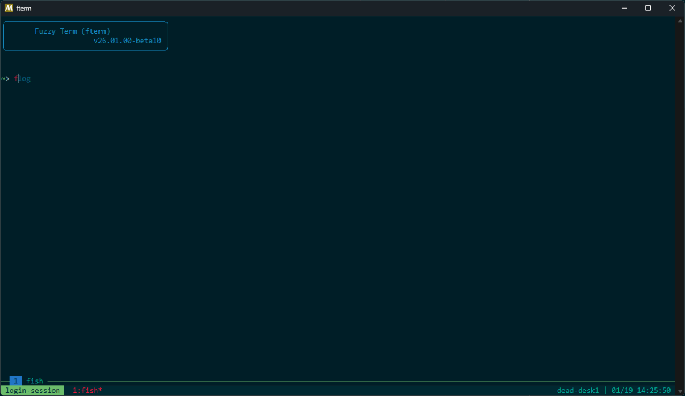
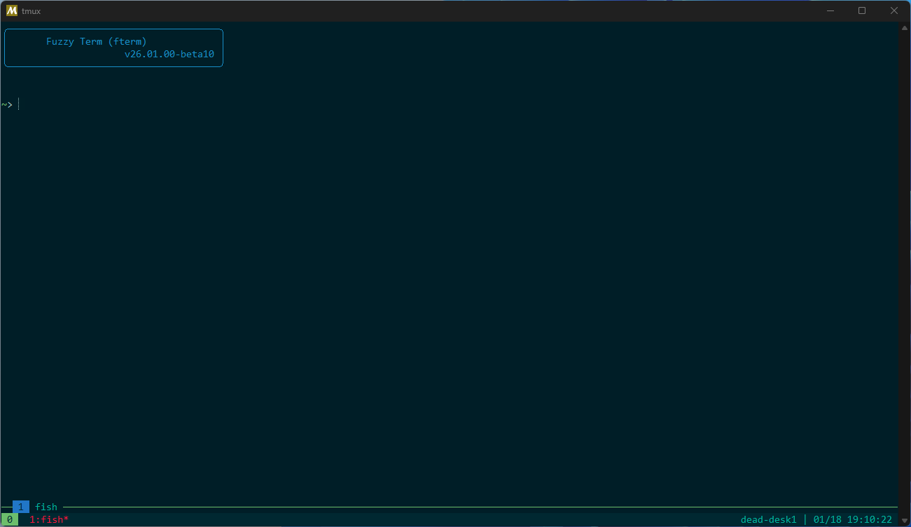

# Fuzzy Term (fterm)



* fssh(Fuzzy SSH)
  * fzf を利用した SSH 先の選択、 MSYS2 でも Win32-OpenSSH を利用した快適な接続
  * Tmux を利用した SSH セッションごとに自動ロギング
  * セッション終了後に自動 gz 圧縮

* [工事中] fcon(Fuzzy Console)
  * [tio](https://github.com/tio/tio) を利用した Serial Console 接続の簡略化
  * fzf を利用して Console デバイスの選択
  * Tmux を利用した Console セッションごとに自動ロギング
  * セッション終了後に自動 gz 圧縮

* flog(Fuzzy log)
  * fterm 類で作成されたログのファイル名単位検索, 全文検索

* fgen(Fuzzy configuration generater)
  * .ssh/config template から生成


> [!Important]
> ssh_config の Match 式には未対応
> fterm の仕様として事前定義済みであり `Host <hoge>` の ssh コマンドが認識できる接続先であることが前提になっている。そのため Match で動的設定される場合 Logging のファイル名を正しく設定出来ないので未対応かつ対応予定は無い。
> `ssh user@<host or IP>` の場合は ssh が認識できるため問題なく Logging される

## これは何?

手元の環境が Windows でどうしても変更出来ないけど大量にある SSH の設定を TeraTerm や Rlogin などの設定や GUI ツールに疲れ、Linux 踏み台で長年使っていた環境を改善、スクリプトを書き直して公開する。  

Tmux との合せ技で `.ssh/config` による接続先の管理をテキストファイルですることで設定の共有が手軽にできるメリットがあるので、 MSYS2 のターミナルと一緒に配布する。

## 使い方

[Releases](https://github.com/naa0yama/fterm/releases) から最新版をダウンロードして、適当な場所に解答展開します。  
私は、`Documents` 配下に置くことが多いです。  

`ucrt64.exe` をダブルクリックすることでターミナルが立ち上がります。


一度起動した後に、再度起動すると設定が反映され下記のようになります。



ssh, scp は Windows 側の `.ssh/config` を参照してホスト候補を出してくれます。  
`fssh` という独自コマンドは

## 前提

Windows 11 側には [Windows 版 OpenSSH](https://github.com/PowerShell/Win32-OpenSSH) と [Git](https://git-scm.com/install/windows) をインストールしておく必要がある

### OpenSSH

```bash
winget install Microsoft.OpenSSH.Preview

```

> [!NOTE]
> winget で自動更新されると 自動起動設定が再度有効化されるので pin に入れて抑止しておくおすすめする
>
> ```powershell{name="pwsh.exe"}
> winget pin add Microsoft.OpenSSH.Preview
>
> ```

OpenSSH は ssh-agent, sshd を自動起動しようとするので無効化しておく

```powershell{name="pwsh.exe"}
#
# 管理者権限プロンプトを立ち上げて作業
#

> Get-Service | Where-Object {$_.Name -match '(CertPropSvc|SCardSvr|ssh-agent|sshd)'} | Select Status, Name, StartType, DisplayName

 Status Name        StartType DisplayName
 ------ ----        --------- -----------
Stopped CertPropSvc Automatic Certificate Propagation
Running SCardSvr    Automatic Smart Card
Stopped ssh-agent   Automatic OpenSSH Authentication Agent
Stopped sshd        Automatic OpenSSH SSH Server


# 自動起動の無効化
> Set-Service -Name "CertPropSvc" -StartupType Disabled
> Stop-Service -Name "CertPropSvc"

> Set-Service -Name "ssh-agent" -StartupType Disabled
> Stop-Service -Name "ssh-agent"

> Set-Service -Name "sshd" -StartupType Disabled
> Stop-Service -Name "sshd"

```

### Git

git もインストールする

```bash
winget install Git.Git

```

## Tmux

本設定集は Tmux の機能を最大限活用する。  
ターミナルの水平垂直分割やロギング設定ででは [Zellij](https://github.com/zellij-org/zellij)(ゼリッジ) にロギング機能がないなどがあり Tmux を採用している。

### 設定ファイル (.tmux.conf)

`skel/.tmux.conf` に tmux の設定ファイルを用意している。以下に主要な設定を説明する。  
通常であれば Release からダウンロードした zip を展開し初めて `ucrt64.exe` 起動した時に自動でコピーされるので個別に設定する必要はない。

#### 基本設定

| 設定項目           | 値             | 説明                                             |
| :----------------- | :------------- | :----------------------------------------------- |
| `escape-time`      | 50             | キーストロークのディレイを減らす(default: 500ms) |
| `default-terminal` | xterm-256color | 端末を 256色に設定                               |
| `history-limit`    | 200000         | スクロール行数(default: 2000)                    |
| `mode-keys`        | vi             | コピーモードで vi キーバインドを使用             |
| `base-index`       | 1              | ウィンドウのインデックスを1から始める            |
| `pane-base-index`  | 1              | ペインのインデックスを1から始める                |

#### マウス設定

マウスモードを有効化しており、以下の操作が可能。

| 操作               | 説明                                           |
| :----------------- | :--------------------------------------------- |
| ペイン選択         | クリックでペインを切り替え                     |
| ペインリサイズ     | ペイン境界をドラッグ                           |
| スクロール         | ホイールでスクロール(自動でコピーモードに入る) |
| 右クリックメニュー | ペイン操作、検索、コピーなどのメニュー表示     |
| ドラッグ選択       | テキスト選択後、自動でコピー                   |

#### テーマ

Solarized Dark Higher Contrast をベースにしたカラーテーマを設定。

- ステータスバー: 青系の文字色、黒背景
- アクティブウィンドウ: 赤系の文字色
- ペイン境界線: アクティブは緑、インアクティブは青系
- ペイン境界線にコマンド名を表示

#### キーバインド

| キー         | 機能                           |
| :----------- | :----------------------------- |
| `prefix + r` | 設定ファイルをリロード         |
| `prefix + c` | 新しいウィンドウ(パス引き継ぎ) |
| `prefix + %` | ペインを水平分割(パス引き継ぎ) |
| `prefix + "` | ペインを垂直分割(パス引き継ぎ) |
| `Alt + ↑↓←→` | ペインを5単位でリサイズ        |

> [!NOTE]
> prefix はデフォルトで `Ctrl+b`

#### コピー＆ペースト

OSC (Operating System Command) 52 はターミナルエスケープシーケンスを使ってクリップボードにアクセスする標準規格。
SSH越しでもクリップボード共有が可能。

##### 端末の対応状況

| 端末             | OSC 52 Copy      | OSC 52 Paste | 備考                    |
| :--------------- | :--------------- | :----------: | :---------------------- |
| VSCode           | ✅ デフォルト有効 |      ❌       | -                       |
| mintty           | ⚠️ 要設定         |   ⚠️ 要設定   | Release 配布分は設定済み |
| WezTerm          | ✅ デフォルト有効 |      ❌       | -                       |
| Windows Terminal | ✅ 有効           |      ❌       | 2023年以降のバージョン  |

> [!TIP] OSC 52 Paste が標準で無効な理由
> セキュリティリスクのため。悪意のあるエスケープシーケンスでクリップボード内容が漏洩する可能性がある。


| キー           | 機能                               |
| :------------- | :--------------------------------- |
| `prefix + [`   | コピーモード開始                   |
| `v`            | 選択開始(コピーモード中)           |
| `y`            | ヤンク(コピーしてコピーモード終了) |
| `prefix + ]`   | tmux バッファからペースト          |
| `Ctrl+Shift+V` | システムクリップボードからペースト |

## mintty の設定

```conf
# ~/.minttyrc

# OSC 52 Copy(端末→クリップボード)
AllowSetSelection=yes

# OSC 52 Paste(クリップボード→端末)※セキュリティリスクあり
AllowPasteSelection=yes
```

| オプション            | 機能                | デフォルト | 備考                   |
| :-------------------- | :------------------ | :--------- | :--------------------- |
| `AllowSetSelection`   | OSC 52 Copy を許可  | no         | 通常はこれだけで十分   |
| `AllowPasteSelection` | OSC 52 Paste を許可 | no         | セキュリティリスクあり |

## 雑記

### アップデート

パッケージの更新は pacman で下記コマンドで実施

```bash
pacman -Syu

```

```bash
# パッケージのインストール
pacman -S --needed <パッケージ名>

# インストール済みパッケージ一覧
pacman -Q

# 明示的にインストールしたパッケージのみ
pacman -Qe

# パッケージを検索（利用可能なもの）
pacman -Ss <キーワード>

# 特定パッケージの情報
pacman -Qi <パッケージ名>

# パッケージに含まれるファイル一覧
pacman -Ql <パッケージ名>
```

### script ...

skel のスクリプトを更新する方法か、更新検知する方法
